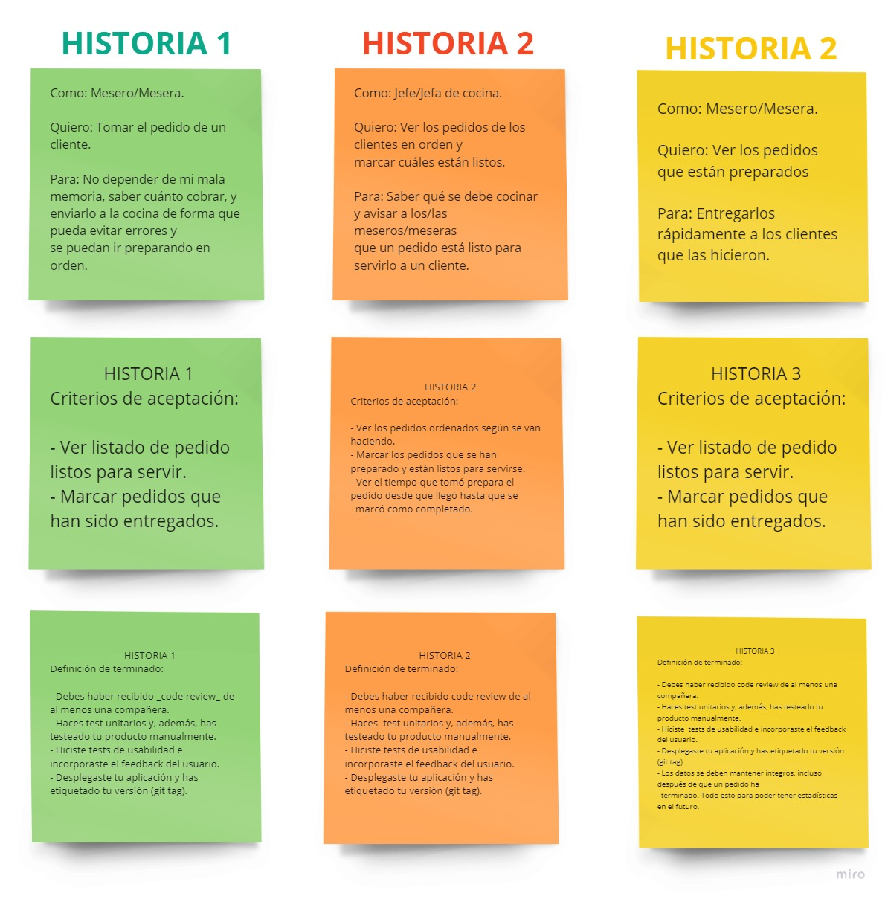
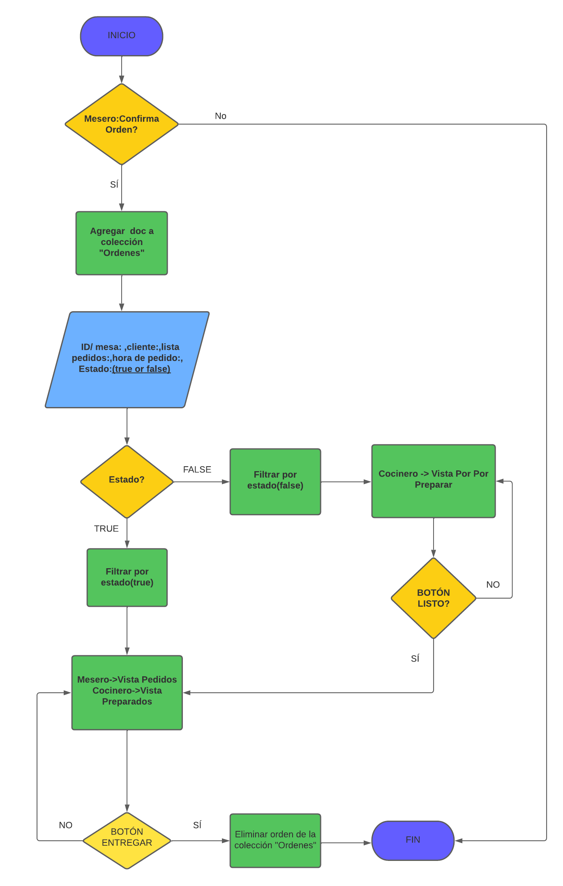
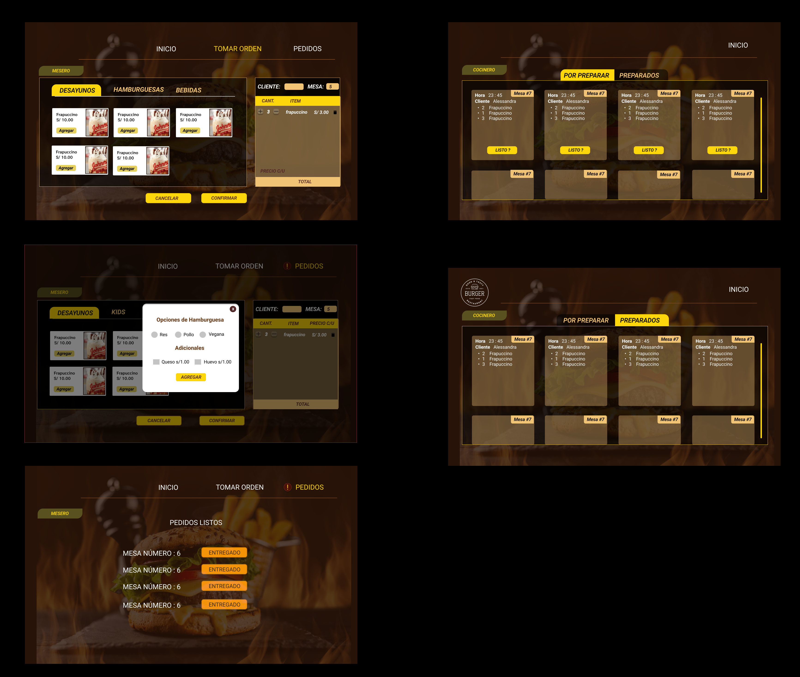
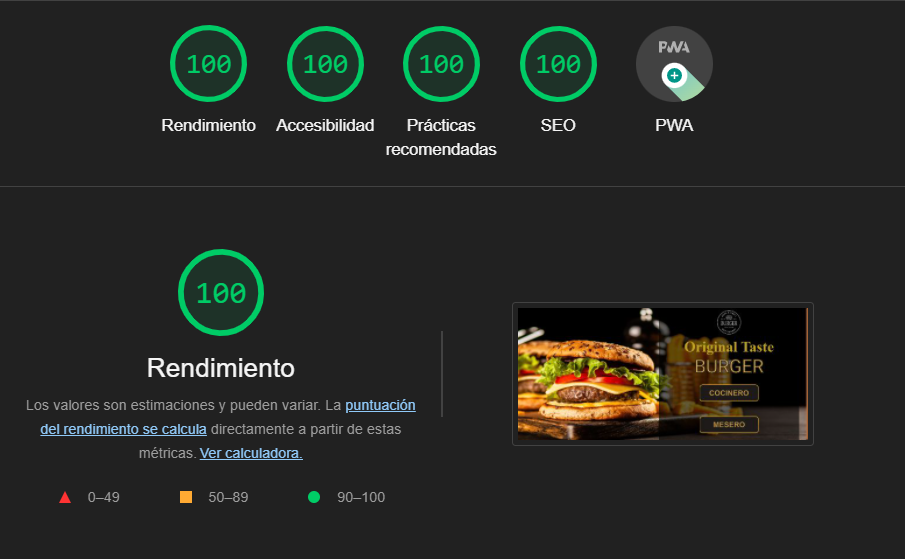
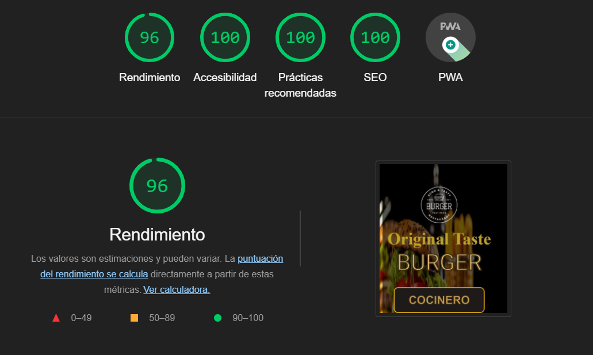

 
  

<h1 align="center"> 🍔 Taste Burger 🍔  </h1>

<h3 align="center"> "La comida es mejor cuando comemos juntos" Original Taste Burger </h3> 

 
  

  

<!-- primary badges -------------------------------------->

   <!-- stars -->
  
  <!-- follow -->
  
  <!-- Twitter intent -->
  

<!-- TABLE OF CONTENTS -->
<h2 id="table-of-contents"> 📖 Table of Contents</h2>

- [1. Resumen del proyecto.](#1-resumen-del-proyecto)
- [2. Definicion del producto](#2-definicion-del-producto)
- [3. Historias de usuario](#3-historias-de-usuarios)
- [4. Flowchart](#flowcharts)
- [5. Realización del proyecto](#realizacion-del-proyecto)
- [6. Resultado final](#resultado-final)
- [7. Tecnologías empleadas](#tecnologias-empleadas)
- [8. Puntuaciones de Performance, Progressive Web App, Accessibility y Best Practices de Lighthouse.](#puntuaciones-de-performance-progressive-web-app-accessibility-y-best-practices-de-lighthouse)
- [9. Fuentes](#fuentes)
- [10. Autores](#autores)

<!-- ABOUT THE PROJECT -->
## 1. 📖 Resumen del proyecto.

 
  El presente proyecto, TASTE BURGER es una aplicación responsive diseñada con React JS, Sass, consumo de Apis entre otras tecnologías de desarrollo web, para la toma de pedidos y el envió de los mismos a cocina, así como también el historial de las ventas realizadas.

_____________________

## 2. 👩‍💻Definición del producto

 El proyecto se inspiro en algunas cadenas de comida, tales como Burger King, McDonald's, Bembos, etc.Lo cual nos sirvió como punto de partida para comenzar con nuestro diseño y flujo de información.

La aplicación y su desarrollo se hicieron basándonos en los requerimientos del cliente e historias de usuario planteadas, cuenta con una sección en donde se muestran los diferentes platillos y bebidas disponibles, el mesero podra seleccionar los productos que desee el cliente, para el caso de las hamburguesas podrá agregar el tipo de carne y los adicionales, también podra visualizar las ordenes que se encuentran listas para entregar. El cocinero podrá visualizar las ordenes que le envié el mesero así como también marcar como listo las ordenes que termine de preparar.

## 3. 📝Historias de usuario

 
  

## 4. 🗒Flowchart

Se implementó un Diagrama de Flujo que nos permitió difinir el proceso e interacción que tendriamos con Firebase y los requerimientos de cada Historia de Usuario.

 
  

## 5. 💻Realización del proyecto

## 5.1 Diseño 📱

### 5.1.1 Wireframe: 🙋🏼

En esta fase se buscó realizar un esquema virtual de distribución más detallado en Figma.Si desea puede verlo en detalle dando click en:

* [Prototipado mobile y navegador](https://www.figma.com/file/Ayu1Z9OvyWQQzrnIK6oqwQ/Untitled?node-id=268%3A2)

### 5.1.2 Prototipado de Alta Fidelidad: 💁🏼

Posteriormente, se realiza el diseño de la web en base a estilos, paleta de colores, entre otros recursos.
A continuación, se mostrará parte del prototipado de alta fidelidad, si desea puede verlo en detalle dando click en:

* [Prototipado mobile y navegador](https://www.figma.com/file/Ayu1Z9OvyWQQzrnIK6oqwQ/Untitled?node-id=0%3A1)

## 6 🚀 Resultado final: 💁🏼

Finalmente, se adjuntará una breve videodemostración del resultado final tanto en diseño como en funcionalidad. Si desea verlo en detalle puede dar click en:

-  [Prototipado videodemostración completa](https://github.com/RJRCH123/LIM016-social-network/blob/dev/practicekmr/src/img/Readme/screen.mp4)

-  [Link para visualizar la página](tasteburger.netlify.app/)

### 🤵 Mesero

  

### 👩‍🍳 Cocinero

  

## 7. Tecnologías empleadas 👩🏾‍💻
-   [HTML:](https://developer.mozilla.org/es/docs/Web/HTML)  Siguiendo las reglas del HTML semántico se estructuró con un  `header`  que contiene una barra de navegación y el  `main`  para englobar el contenido principal.

-   [SASS:](https://developer.mozilla.org/es/docs/Web/CSS)  Usada para definir el estilo visual del proyecto.

-   [Figma:](https://www.figma.com) Plataforma para crear las estructuras del prototipo (Wireframe, prototipo de alta fidelidad, mockups).

-   [React.js:](https://es.reactjs.org/) Librería implementada para crear una interfaz de usuario interactiva de manera sencilla.

-   [Javascript:](https://developer.mozilla.org/es/docs/Web/JavaScript)  Para dar la funcionalidad a la plataforma.
-   [Firebase:](https://firebase.google.com) Se trata de una plataforma móvil creada por Google, cuya principal función es desarrollar y facilitar la creación de apps de elevada calidad de una forma rápida.

-   [Testing Library:](https://testing-library.com)  Es una solución muy liviana para realizar pruebas sin todos los detalles de implementación.

-   [Eslint:](https://jestjs.io/docs/es-ES/getting-started)  Herramienta de linting para analizar el código en busca de errores.

- [PWA:](https://www.iebschool.com/blog/progressive-web-apps-analitica-usabilidad/) Progressive web apps (PWA) o aplicación web progresiva es una solución basada en la web tradicional que todos conocemos. La aplicación desplegada tiene más del 80% en puntuaciones de Performance, Progressive Web App, Accessibility y Best Practices de Lighthouse.

## 8.📊 Puntuaciones de Performance, Progressive Web App, Accessibility y Best Practices de Lighthouse.

 🖥 Vista Desktop

 📱 Vista Mobile

## 9. Fuentes 📚

- [Repositorio de Laboratoria:](https://github.com/Laboratoria/LIM016-burger-queen) Se encuentran todas las condiciones y herramientas a trabajar para el proyecto.

## 10. Autores 📍
- [Yumari](https://github.com/Yumari081196)
- [Katerin Tello](https://github.com/KaterinT)

- Equipo de Laboratoria LIM016

****

